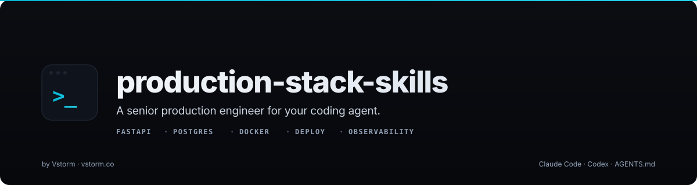

<h1 align="center">Production Stack Skills</h1>

<p align="center">
  
</p>

<p align="center">
  <b>Turn your coding agent into a senior production engineer.</b><br>
  Skill pack for FastAPI, PostgreSQL, Docker, deployment, and observability — works with Claude Code, Codex, and any AGENTS.md-compatible agent CLI.
</p>

<p align="center">
  <a href="#-quick-start">Install</a> &middot;
  <a href="#-commands">Commands</a> &middot;
  <a href="#-skills">Skills</a> &middot;
  <a href="#-the-production-check-experience">/production check</a> &middot;
  <a href="#-architecture">Architecture</a>
</p>

<p align="center">
  <a href="https://github.com/vstorm-co/production-stack-skills/stargazers"></a>
  <a href="https://www.python.org/downloads/"></a>
  <a href="https://opensource.org/licenses/MIT"></a>
  <a href="https://claude.ai/claude-code"></a>
  <a href="https://agents.md/"></a>
  <a href="https://vstorm.co"></a>
  <a href="https://x.com/Kacper95682155"></a>
</p>

---

## Why This Exists

**Stop shipping demo-quality code.** AI generates code fast — this skill pack makes it generate code that survives production.

| Metric | Source |
|--------|--------|
| 45% of AI-generated code has security vulnerabilities | State of Software Delivery 2025 |
| 67% of developers spend MORE time debugging AI code | Developer Survey 2025 |
| 78% of Fortune 500 companies are adopting AI coding | Enterprise AI Report 2026 |

The gap between "it works" and "it survives Black Friday at 3 AM" is what this skill pack closes.

Every Claude Code skill teaches *how* to build something. None teach *how to make it survive production*. Missing health checks, unsafe migrations, root containers, no graceful shutdown — these are the things that page you at 3 AM.

**production-stack-skills** is the senior engineer sitting next to you that catches these issues before they ship.

---

## 🚀 Quick Start

### One-Command Install (macOS & Linux)

```bash
curl -fsSL https://raw.githubusercontent.com/vstorm-co/production-stack-skills/main/install.sh | bash
```

The installer mirrors skills into both `~/.claude/` and `~/.agents/` — so the same install works with Claude Code, Codex, or any AGENTS.md-compatible agent CLI without extra steps.

### Manual Install

```bash
git clone https://github.com/vstorm-co/production-stack-skills.git
cd production-stack-skills
./install.sh
```

### Requirements

- **An agent CLI** — [Claude Code](https://claude.ai/claude-code), [Codex](https://github.com/openai/codex), or any [AGENTS.md](https://agents.md/)-compatible agent
- **Python 3.10+** — for audit scripts
- **Git** — for cloning

### Uninstall

```bash
curl -fsSL https://raw.githubusercontent.com/vstorm-co/production-stack-skills/main/uninstall.sh | bash
```

---

## 🧰 Commands

| Command | What It Does |
|---------|--------------|
| `/production check` | Full audit with 0-100 score and prioritized action plan |
| `/production score` | Quick 60-second headline score |
| `/production fastapi` | Apply FastAPI production patterns |
| `/production postgres` | Safe migrations, pooling, indexes |
| `/production docker` | Multi-stage builds, non-root, minimal images |
| `/production deploy` | Pre-deployment checklist |
| `/production monitoring` | OTEL traces, structured logging, metrics, alerts |
| `/production security` | Secrets, CORS, auth, rate limiting, OWASP checks |
| `/production errors` | Error taxonomy, retries, circuit breakers |
| `/production review` | Production-readiness code review |
| `/production plan` | Architecture planning with production constraints |
| `/production report` | Shareable Markdown readiness report |

---

## 🎯 The `/production check` Experience

The flagship command. Scans your entire project across six categories and scores it 0-100:

```
## Production Readiness Audit

Project: my-fastapi-app
Stack: Python 3.12 / FastAPI 0.115 / PostgreSQL 16 / Docker
Score: 34/100 — Grade F

| Category                    | Score  | Weight | Weighted |
|-----------------------------|--------|--------|----------|
| Security Fundamentals       | 40/100 | 25%    | 10       |
| Error Handling & Resilience | 25/100 | 20%    | 5        |
| Observability               | 20/100 | 20%    | 4        |
| Deployment Readiness        | 50/100 | 15%    | 7.5      |
| Database Patterns           | 60/100 | 10%    | 6        |
| Container Hygiene           | 15/100 | 10%    | 1.5      |
| Total                       |        |        | 34/100   |

Quick Wins (< 5 minutes each):
  [+12 pts] Replace print() with structlog
  [+8 pts]  Add /health/live and /health/ready endpoints
  [+6 pts]  Add USER directive to Dockerfile
  [+4 pts]  Add .dockerignore

Fix these 4 items → score jumps from 34 to ~64.
```

---

## 📚 Skills

| Skill | What It Teaches | Works With |
|-------|----------------|------------|
| **production-check** | Full audit with 0-100 scoring, parallel analysis, prioritized action plan | Any stack |
| **production-review** | Production-readiness code review — security, errors, logging, config, performance | Python, Node.js, Go, Java |
| **production-planner** | Architecture planning with scalability, failure modes, cost constraints | Any stack |
| **production-fastapi** | Lifespan, ASGI middleware, structured logging, health checks, Pydantic v2, async | Python / FastAPI |
| **production-postgres** | Zero-downtime migrations, indexing strategies, connection pooling, schema design | PostgreSQL |
| **production-docker** | Multi-stage builds, non-root, distroless, BuildKit secrets, security scanning | Docker / OCI |
| **production-deploy** | Pre-deployment checklist, migration classification, rollback playbook, CI/CD | Any CI/CD |
| **production-monitoring** | OpenTelemetry, structlog, Prometheus metrics, health endpoints, SLO definition | Any stack (OTEL) |
| **production-security** | Secrets management, CORS, JWT, rate limiting, security headers, OWASP Top 10 | Any stack |
| **production-error-handling** | Error taxonomy, retry with backoff, circuit breakers, graceful degradation, DLQ | Any stack |

---

## 🔗 How Skills Work Together

Skills trigger automatically based on context and reinforce each other:

```
"Create a FastAPI endpoint"
  → production-fastapi activates: structured logging, health checks, error handling

"Write a migration to add a NOT NULL column"
  → production-postgres activates: 3-step safe pattern, lock_timeout, rollback script

"Create a Dockerfile"
  → production-docker activates: multi-stage, non-root, distroless, HEALTHCHECK

"Is this production ready?"
  → production-check activates: full 6-category audit with score
```

After completing one skill, related skills are suggested:
> "Your FastAPI patterns are solid. Run `/production docker` to harden your container, and `/production check` for a full audit."

---

## 🏗 Architecture

```
production/SKILL.md              ← Orchestrator (routes /production subcommands)
│
├── skills/
│   ├── production-check/        ← Full audit with 0-100 scoring
│   ├── production-fastapi/      ← FastAPI production patterns
│   ├── production-postgres/     ← PostgreSQL safety & performance
│   ├── production-docker/       ← Container hardening
│   ├── production-deploy/       ← Pre-deployment validation
│   ├── production-monitoring/   ← Observability
│   ├── production-security/     ← Security hardening
│   ├── production-error-handling/ ← Resilience patterns
│   ├── production-review/       ← Code review
│   └── production-planner/      ← Architecture planning
│
├── agents/                      ← Parallel audit subagents
├── checklists/                  ← Reusable reference checklists
├── install.sh                   ← One-command installer
└── uninstall.sh
```

---

## 🧭 Philosophy

1. **Opinionated over generic** — We recommend specific tools and patterns, not abstract advice
2. **Production-proven** — Every pattern comes from real incident post-mortems
3. **Fail-safe defaults** — When in doubt, the safer option wins
4. **Progressive adoption** — Each skill works alone; together they cover the full stack
5. **LLM judges taste; scripts judge facts** — Deterministic checks where possible, LLM judgment where needed

---

## Contributing

Pull requests welcome. Pattern to add new skills:

1. Create skill directory in `skills/production-<name>/`
2. Add `SKILL.md` with frontmatter (name, description) and content
3. Add to orchestrator router in `production/SKILL.md`
4. Add auditor in `agents/` if parallel audit needed
5. Optional: templates in `templates/`, references in `references/`

---

## Vstorm OSS Ecosystem

**production-stack-skills** is part of a broader open-source ecosystem for production AI agents:

| Project | Description | |
|---------|-------------|---|
| **[pydantic-deep](https://github.com/vstorm-co/pydantic-deep)** | The batteries-included deep agent harness for Python. Terminal AI assistant or production agents with one function call. | [](https://github.com/vstorm-co/pydantic-deep) |
| **[full-stack-ai-agent-template](https://github.com/vstorm-co/full-stack-ai-agent-template)** | Zero to production AI app in 30 minutes. FastAPI + Next.js 15, 6 AI frameworks, RAG pipeline, 75+ config options. | [](https://github.com/vstorm-co/full-stack-ai-agent-template) |
| **[content-skills](https://github.com/vstorm-co/content-skills)** | Claude Code content studio — blog, social, slides, video, infographics — all brand-aware. | [](https://github.com/vstorm-co/content-skills) |
| **[pydantic-ai-shields](https://github.com/vstorm-co/pydantic-ai-shields)** | Drop-in guardrails for Pydantic AI agents. 5 infra + 5 content shields. | [](https://github.com/vstorm-co/pydantic-ai-shields) |
| **[pydantic-ai-subagents](https://github.com/vstorm-co/pydantic-ai-subagents)** | Declarative multi-agent orchestration with token tracking. | [](https://github.com/vstorm-co/pydantic-ai-subagents) |
| **[summarization-pydantic-ai](https://github.com/vstorm-co/summarization-pydantic-ai)** | Smart context compression for long-running agents. | [](https://github.com/vstorm-co/summarization-pydantic-ai) |
| **[pydantic-ai-backend](https://github.com/vstorm-co/pydantic-ai-backend)** | Sandboxed execution for AI agents. Docker + Daytona. | [](https://github.com/vstorm-co/pydantic-ai-backend) |

Browse all projects at [oss.vstorm.co](https://oss.vstorm.co)

---

## License

MIT — see [LICENSE](LICENSE)

---

<div align="center">

### Need help shipping production-grade backends?

<p>We're <a href="https://vstorm.co"><b>Vstorm</b></a> — an Applied Agentic AI Engineering Consultancy<br>with 30+ production agent implementations. These patterns come from 50+ production deployments.</p>

<a href="https://vstorm.co/contact-us/">
  
</a>

<br><br>

Made with **care** by <a href="https://vstorm.co"><b>Vstorm</b></a>

</div>
